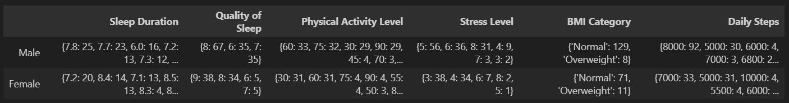
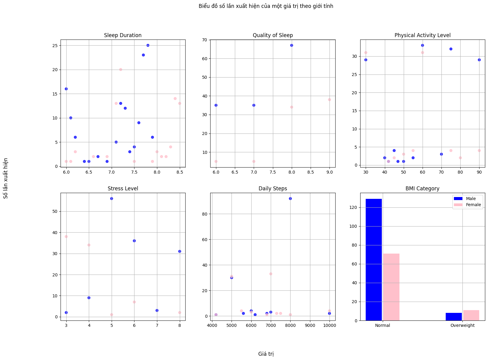
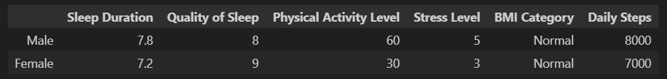
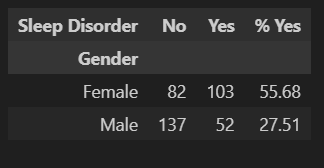
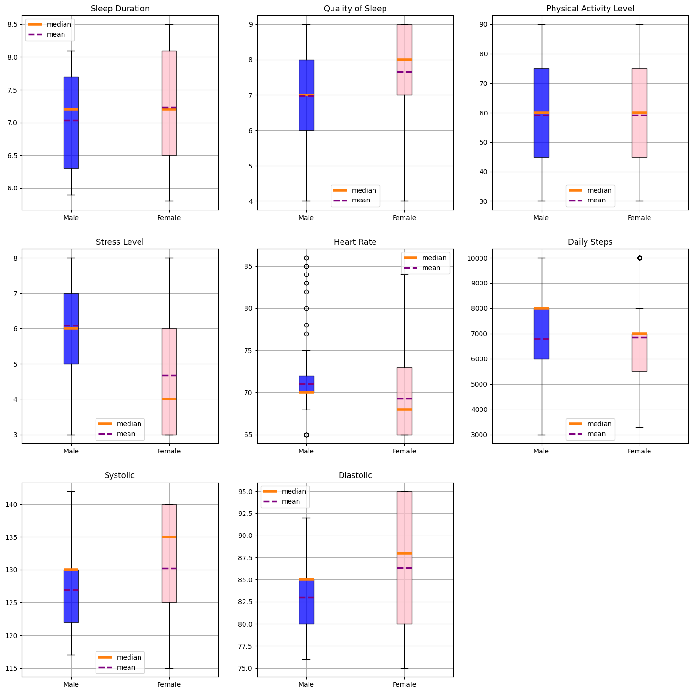
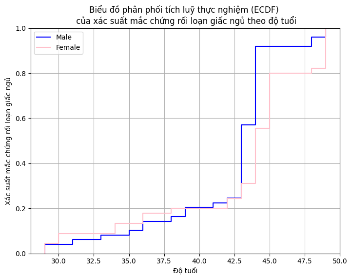
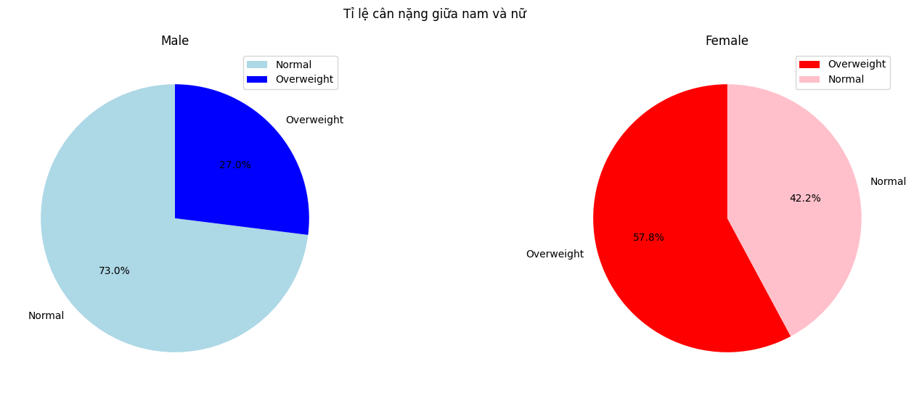
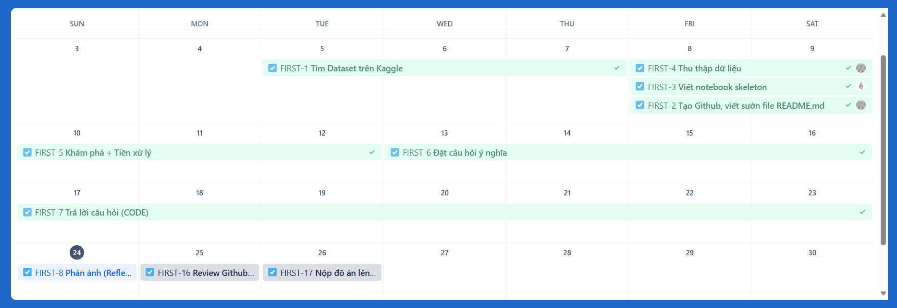

# PROGRAMMING FOR DATA SCIENCE - FIT - HCMUS

## Final Project - Thu thập, phân tích và trả lời câu hỏi về bộ dữ liệu Sleep Health và Lifestyle

### I. Thông tin nhóm:

- Lớp: 21KHDL1

| #        | Họ tên           |
| -------- | ---------------- |
| 21127587 | Nguyễn Trọng Đại |
| 21127726 | Nguyễn Tấn Khiêm |

### II. Thông tin đề tài:

#### **_01. Dataset:_**

- [Sleep Health and Lifestyle Dataset](https://www.kaggle.com/datasets/uom190346a/sleep-health-and-lifestyle-dataset) gồm 400 hàng và 13 cột, chứa nhiều biến số liên quan đến giấc ngủ và lối sống. Nó bao gồm các chi tiết như giới tính, tuổi tác, nghề nghiệp, thời gian ngủ, chất lượng giấc ngủ, mức độ hoạt động thể chất, mức độ căng thẳng, chỉ số BMI, huyết áp, nhịp tim, số bước đi hàng ngày và sự hiện diện hay vắng mặt của rối loạn giấc ngủ. Bộ dataset này sẽ cho bạn cái nhìn tổng quan về sự ảnh hưởng của lối sống và sức khoẻ đối với chứng rối loạn giấc ngủ.

- Tác giả: [Laksika Tharmalingam](https://www.kaggle.com/uom190346a)
- License: CC0: Public Domain

#### **_02. Các câu hỏi có ý nghĩa:_**

- **Câu hỏi 1**: Lối sống lý tưởng để không bị rối loạn giấc ngủ là gì?

    - **Thành viên phụ trách**: Nguyễn Trọng Đại
    
    - **Mục đích**: Đưa ra mẫu hình lý tưởng về lối sống để từ đó mỗi người có thể tự điều chỉnh bản thân, giúp bản thân có một giấc ngủ ngon, không mắc chứng rối loạn khi đang ngủ.

    - **Ý tưởng thực hiện**: Phân tích các đặc trưng liên quan đến lối sống, tìm ra giá trị phù hợp ở mỗi đặc trưng (giá trị có tần suất rối loạn giấc ngủ là ít nhất), kết hợp các giá trị để đưa ra mẫu hình lý tưởng. Gộp nhóm các giá trị theo giới tính vì sinh học của nam và nữ là khác nhau, cần có hình mẫu riêng.

- **Câu hỏi 2**: Liệu nam giới hay nữ giới bị rối loạn giấc ngủ nhiều hơn và tại sao?

    - **Thành viên phụ trách**: Nguyễn Trọng Đại

    - **Mục đích**: Giúp chúng ta có cái nhìn tổng quát về sự ảnh hưởng của giới tính đối với chứng rối loạn giấc ngủ cũng như tác nhân gây ra nó.

    - **Ý tưởng thực hiện**: Phân tích tỷ lệ bị rối loạn giấc ngủ giữa nam và nữ, sau đó phân tích sự ảnh hưởng (mối quan hệ) của các đặc trưng khác theo từng giới tính.

#### **_03. Phân tích các câu hỏi:_**

- **Câu hỏi 1**: Lối sống lý tưởng để không bị rối loạn giấc ngủ là gì?

    - Các bước phân tích dữ liệu:

        - Bước 1: Tính số lần xuất hiện cho từng giá trị của mỗi cột, gộp nhóm theo giới tính.

        - Bước 2: Trực quan hoá bước 1.

        - Bước 3: Chọn các giá trị tốt nhất (số lần xuất hiện nhiều nhất) của từng cột, đưa ra mẫu hình lối sống lý tưởng cho từng giới tính.

- **Câu hỏi 2**: Liệu nam giới hay nữ giới bị rối loạn giấc ngủ nhiều hơn và tại sao?

    - Các bước phân tích dữ liệu:

        - Bước 1: Tính số lượng bị và không bị rối loạn giấc ngủ, đưa ra tỷ lệ phần trăm cho từng giới tính.

        - Bước 2: Kiểm tra khoảng trung bình giữa nam và nữ trong các cột Numeric: `Sleep Duration`, `Quality of Sleep`, `Physical Activity Level`, `Stress Level`, `Heart Rate` và `Daily Steps`.

        - Bước 3: Dùng phân phối tích luỹ thực nghiệm để tính xác suất bị rối loạn giấc ngủ tăng dần theo độ tuổi.

        - Bước 4: Xác định tỷ lệ cân nặng giữa nam và nữ.

    - Bước 1 để trả lời phần `Liệu nam giới hay nữ giới bị rối loạn giấc ngủ nhiều hơn` và các bước còn lại là dựa vào biểu đồ để tìm ra nguyên nhân.

#### **_04. Kế hoạch thực hiện:_**

