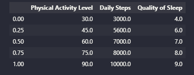
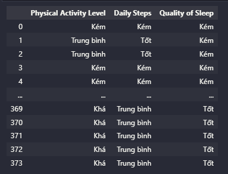
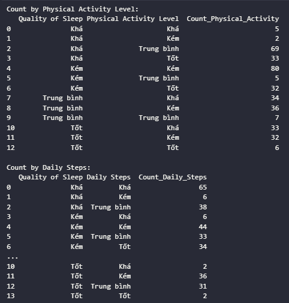
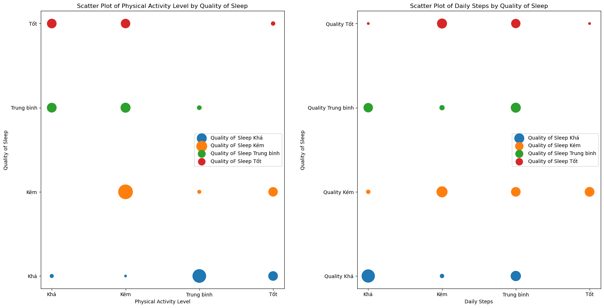
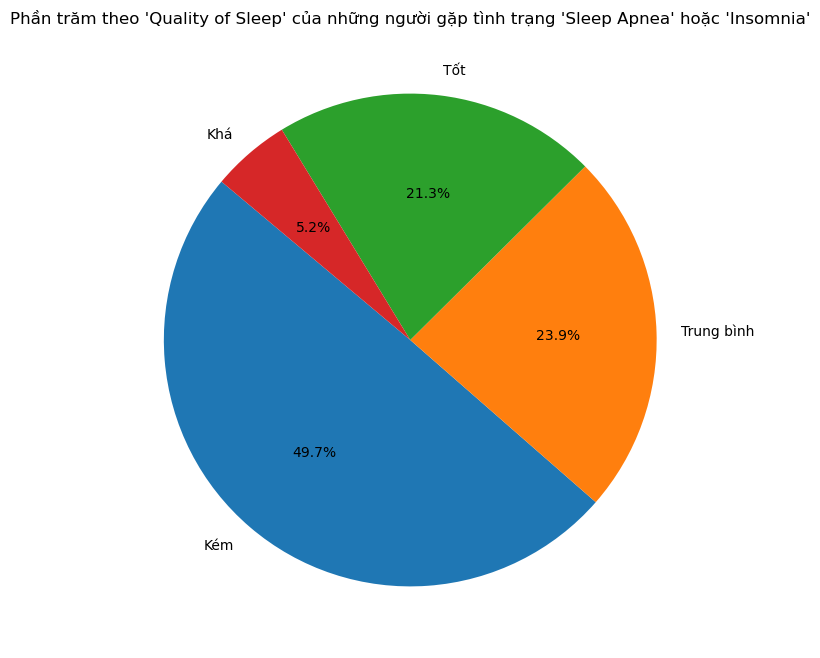
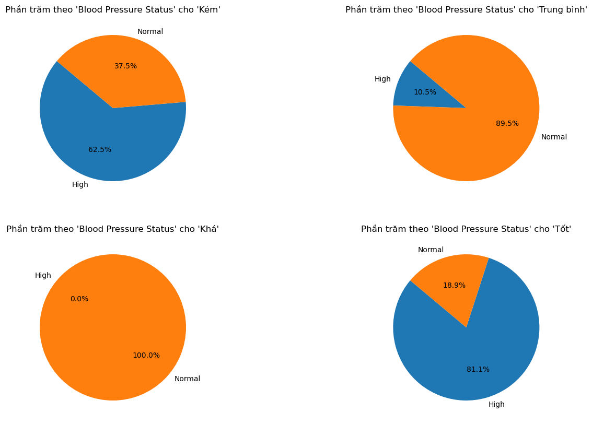
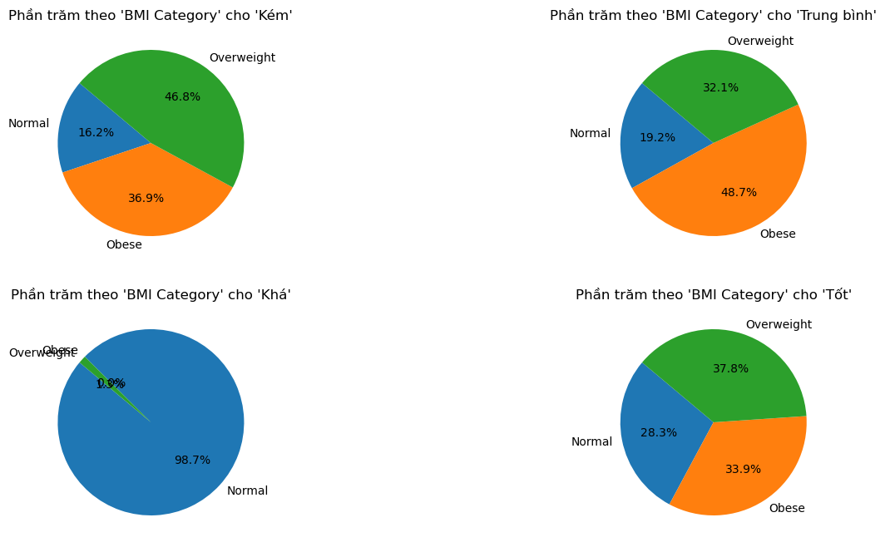
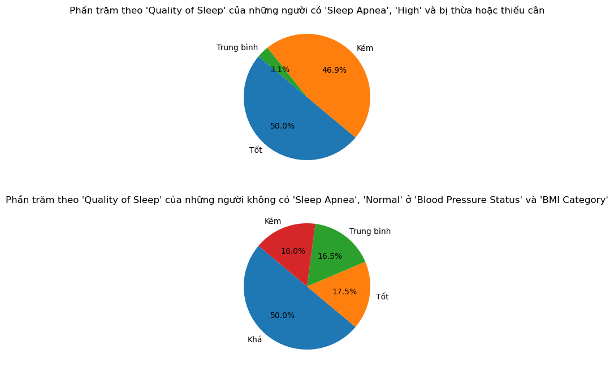
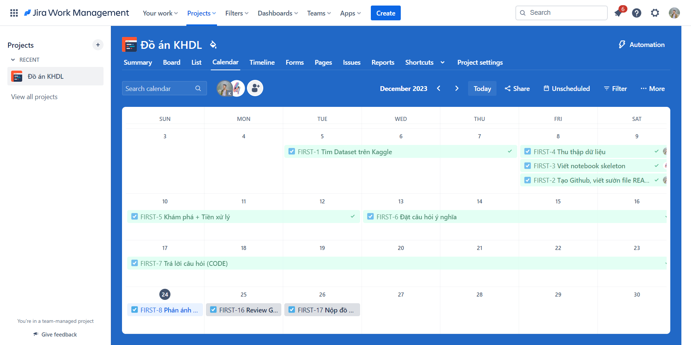

# PROGRAMMING FOR DATA SCIENCE - FIT - HCMUS

## Final Project - Thu thập, phân tích và trả lời câu hỏi về bộ dữ liệu Sleep Health và Lifestyle

### I. Thông tin nhóm:

- Lớp: 21KHDL1

| MSSV     | Họ tên           |
| -------- | ---------------- |
| 21127587 | Nguyễn Trọng Đại |
| 21127726 | Nguyễn Tấn Khiêm |

### II. Thông tin đề tài:

#### **_01. Dataset:_**

[Sleep Health and Lifestyle Dataset](https://www.kaggle.com/datasets/uom190346a/sleep-health-and-lifestyle-dataset) bao gồm 400 hàng và 13 cột, bao gồm nhiều biến số liên quan đến giấc ngủ và thói quen hàng ngày. Nó bao gồm các chi tiết như giới tính, tuổi tác, nghề nghiệp, thời gian ngủ, chất lượng giấc ngủ, mức độ hoạt động thể chất, mức độ căng thẳng, chỉ số BMI, huyết áp, nhịp tim, số bước đi hàng ngày và sự hiện diện hay vắng mặt của rối loạn giấc ngủ.

#### **_02. Các câu hỏi có ý nghĩa:_**

- Câu hỏi 3: Liệu có mối liên quan nào giữa mức độ hoạt động vận động hàng ngày và chất lượng giấc ngủ?
  - Thành viên phụ trách: Nguyễn Tấn Khiêm
  - Mục đích: Điều tra xem liệu việc tăng cường hoạt động vận động có thể ảnh hưởng đến chất lượng giấc ngủ hay không, từ đó có thể đề xuất giải pháp cải thiện giấc ngủ thông qua việc thay đổi mức độ hoạt động hàng ngày.
  - Ý tưởng thực hiện: Kết hợp dữ liệu về Quality of Sleep với thông tin về Physical Activity Level và Daily Steps để xác định mức độ ảnh hưởng của chất lượng giấc ngủ đối với hiệu suất công việc và sức khỏe tổng thể.
- Câu hỏi 4: Làm thế nào chất lượng giấc ngủ ảnh hưởng đến sức khỏe của người tham gia khảo sát?
  - Thành viên phụ trách: Nguyễn Tấn Khiêm
  - Mục đích: Tìm hiểu về mối quan hệ giữa chất lượng giấc ngủ ảnh hưởng đến sức khỏe tổng thể, nhằm đưa ra những khuyến nghị về quản lý giấc ngủ trong môi trường làm việc.
  - Ý tưởng thực hiện: Kết hợp dữ liệu về Quality of Sleep với thông tin về Stress Level, BMI Category, Systolic, Diastolic, Heart Rate và Sleep Disorder để xác định mức độ ảnh hưởng của chất lượng giấc ngủ đối với hiệu suất công việc và sức khỏe tổng thể.

#### **_03. Phân tích các câu hỏi:_**

- Câu hỏi 3: Liệu có mối liên quan nào giữa mức độ hoạt động vận động hàng ngày và chất lượng giấc ngủ?

  - Các bước phân tích dữ liệu:

    - Bước 1: Xác định các phân vị của các cột.

    - Bước 2: Các giá trị của từng cột sẽ được chia theo phân vị, các giá trị nằm trong khoảng Minimum đến Quartile 1 sẽ là 1(ít/kém), nằm trong khoảng hơn Quartile 1 và Quartile 2 sẽ là 2(trung bình), từ hơn Quartile 2 đến Quartile 3 là 3(khá) và từ hơn Quartile 3 Maximum sẽ là 4(tốt).
    - 
    - Bước 3: Đếm xem sự xuất hiện của các giá trị 1,2,3,4 của 'Physical Activity Level' và 'Daily Steps' như thế nào theo nhóm 1,2,3,4 của 'Quality of Sleep'.
    - 
    - Bước 4: Sử dụng biểu đồ scatter để trực quan hóa.
    - 

- Câu hỏi 4: Làm thế nào chất lượng giấc ngủ ảnh hưởng đến sức khỏe của người tham gia khảo sát?
  - Các bước phân tích dữ liệu:
    - Bước 1: Ta sẽ tiếp tục chia cột 'Quality of Sleep' theo phân vị như Câu hỏi 3. Sau đó xem những người gặp tình trạng 'Sleep Apnea' hoặc 'Insomnia' có phần trăm thế nào theo 'Quality of Sleep'.
    - 
    - Bước 2: Xác định phần trăm tình trạng 'High'và 'Normal' của 'Blood Pressure Status' theo từng 'Quality of Sleep'.
    - 
    - Bước 3: Tương tự với cột 'BMI Category'.
    - 
    - Bước 4: Xem những người có tình trạng 'Sleep Apnea', 'High' ở 'Blood Pressure Status' và bị thừa hoặc thiếu cân sẽ có chất lượng giấc ngủ như thế nào và xem những người không có tình trạng 'Sleep Apnea', 'Normal' ở 'Blood Pressure Status' và 'BMI Category' sẽ có chất lượng giấc ngủ như thế nào.
    - 

#### **_04. Kế hoạch thực hiện:_**

